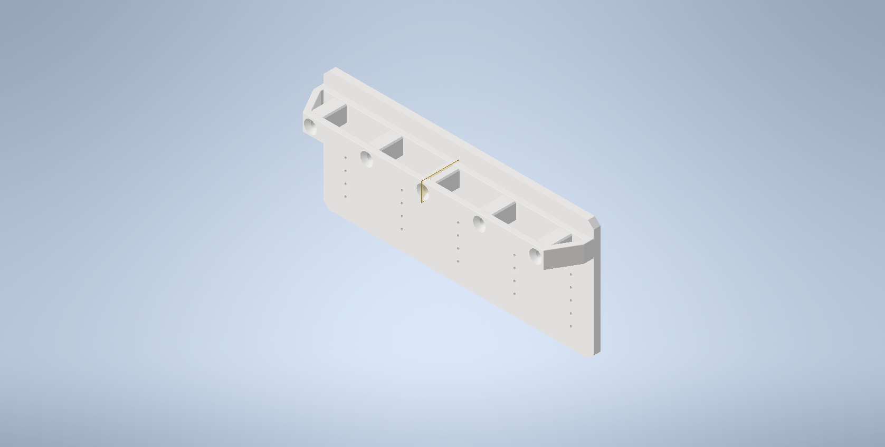
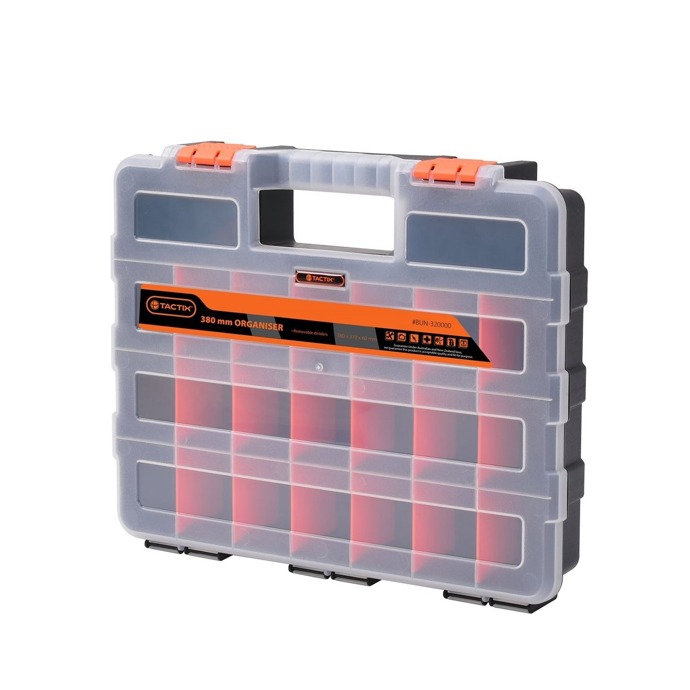

# Storage-Rack

<table>
    <tr>
        <td>
            <b>Inventor (2022)</b>
        </td>
    </tr>
    <tr>
        <td>
            
        </td>
    </tr>
</table>

## About

This is a 3D printed set of guides for storing 380mm plastic storage organizers as depicted below.
In theory, you could modify this model to fit any organizer, but these were just the ones available
to me.

## Printing

| Parameter       | Value      |
| --------------- | ---------- |
| Material Type   | PLA        |
| Material Weight | 36g        |
| Layer Height    | 0.2mm      |
| Printing Time   | 3.00 Hours |
| Printer Model   | Ender3 V2  |

## Improvements

-   None to note, possibly chance to reduce material usage by better designing the inner support
    structure.
